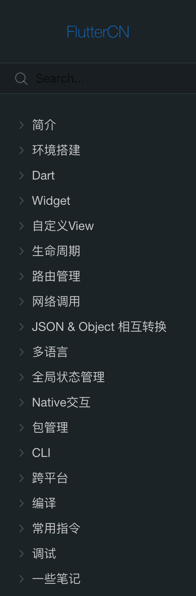
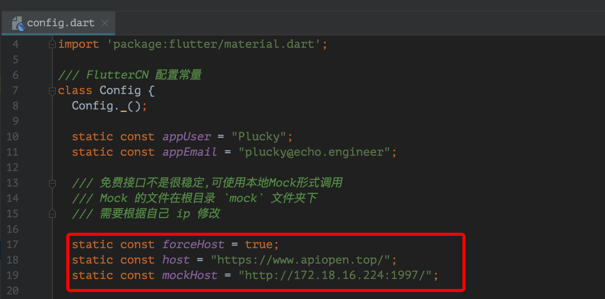

# FlutterCN
A Project to Share About FlutterCN.Flutter学习与分享

## 界面展示
<div align="center">


</div>

## 文档地址
- [如何用Flutter从0-1构建一个APP](http://www.echo.engineer/FlutterCN/#/)



## 免费API
- [开源社区](https://www.apiopen.top/api.html#top)
- [新闻接口](https://www.apiopen.top/journalismApi)
- [天气获取接口](https://www.apiopen.top/weatherApi?city=成都)
- [美图获取接口](https://www.apiopen.top/meituApi?page=1)
- [网易云音乐API](https://github.com/Binaryify/NeteaseCloudMusicApi)

## 接口说明
`DEMO` 中使用的接口主要是 [天气获取接口](https://www.apiopen.top/weatherApi?city=北京) 和 [新闻接口](https://www.apiopen.top/journalismApi)，但是接口不是很稳定，大家如果出现接口无法访问，可以通过本地 `Mock` 的形式.`Mock`的json文件在根目录 `mock` 目录下。然后修改 `Config` 文件中的 Mock 地址。



我一般使用 `nodejs` [ssr](https://www.npmjs.com/package/ssr),进入 `mock` 目录,然后mock接口。如下：
```
FlutterCN git:(master) ✗ cd mock
➜  mock git:(master) ✗ ssr -p 1997

 Static file server running at

=> http://localhost:1997

```

`http://localhost:1997` 改成你电脑的ip的地址 `http://172.18.16.224:1997/`


## 计划
1. 用 Flutter 开发一个资讯类APP
2. 要求内容
	- [x] 新闻Feed流
	- [x] 天气
3. 技术栈
	- [x] Dart 语言简介
	- [x] 接口
	- [x] 序列化
	- [x] Flutter 调试&日志
	- [x] 使用 iconfont
	- [x] 多语言
	- [x] web开发
	- [x] 路由
	- [x] 启动页
	- [x] 数据持久化：KV、~~SQLite~~
	- [x] 主题: provider 全局状态同步
	- [x] 与原生APP交互	[链接](https://flutter.cn/docs/development/platform-integration/platform-channels)
	- [x] 自定义View		[链接](https://api.flutter.dev/flutter/dart-ui/BlendMode-class.html)
	- [x] 生命周期
	- [x] MVVM
	- [x] AOP [AspectD](https://www.yuque.com/xytech/flutter/aukvx8)
	- [ ] 控件实践：长线
	- [ ] 动画实践：长线 https://flutterchina.club/animations/
	- [x] Flutter 终端指令
	- [x] ~MacOs & Windows App 开发~
	- [x] Mock Release & Debug
4. 文档输出
	- [x] 开发环境: Dart & Flutter & pub
	- [x] 包管理: pub&git&path&发布自己的包
	- [x] 常用指令
	- [x] jit,aot
	- [x] 原理解析:渲染机制、消息机制
	- [ ] ~~关键字解读~~
	- [x] 遇到的问题
	- [ ] 技术总结与展望
	- [ ] 快速集成：`Jenkins` 打包,渠道分发
	- [ ] 目录结构解析：协作&`git submodule`
