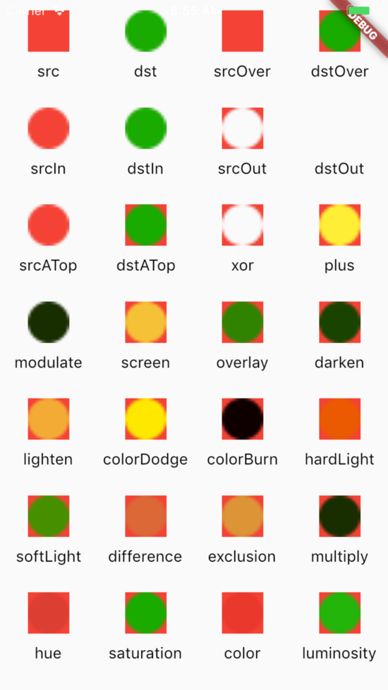

## 自定义View

## ClipPath
Clipxxx 原理完全一致

```
ClipPath(
  child: Stack(),
  clipper: HeaderColor(),
);


class HeaderColor extends CustomClipper<Path> {
  @override
  Path getClip(Size size) {
    var path = Path()
      ..lineTo(0.0, size.height / 2)
      ..lineTo(size.width, size.height / 2 - 100)
      ..lineTo(size.width, 0)
      ..close();
    return path;
  }

  @override
  bool shouldReclip(CustomClipper<Path> oldClipper) => oldClipper != this;
}
```

## CustomPaint
自定义绘制,点线面,贝舍尔曲线,BlendMode,etc
- 画点 - drawPoints(PointMode pointMode, List points, Paint paint)
- 画线 - drawLine(Offset p1, Offset p2, Paint paint)
- 画矩形 - drawRect(Rect rect, Paint paint)
- 画圆角矩形 - drawRRect(RRect rrect, Paint paint)
- 画矩形环 - drawDRRect(RRect outer, RRect inner, Paint paint)  
- 画圆弧或扇形 - drawArc(Rect rect, double startAngle, double sweepAngle, bool useCenter, Paint paint)
- 画圆 - drawCircle(Offset c, double radius, Paint paint)
- 画椭圆 - drawOval(Rect rect, Paint paint)
- 填充颜色 - drawColor(Color color, BlendMode blendMode)
- 画文字 - drawParagraph(Paragraph paragraph, Offset offset)
- 画图片 - drawImage(Image image, Offset p, Paint paint) / drawImageRect(Image image, Rect src, Rect dst, Paint paint)

## Path
- 画路径 - drawPath(Path path, Paint paint)
- 移动到某点 - moveTo(double x, double y) / relativeMoveTo(double dx, double dy)
- 向目标位置画直线 - lineTo(double x, double y) / relativelineTo(double x, double y)
- 画弧线 - arcTo(Rect rect, double startAngle, double sweepAngle, bool forceMoveTo)
- 画二阶贝塞尔曲线 - quadraticBezierTo(double x1, double y1, double x2, double y2) & relativeQuadraticBezierTo(double x1, double y1, double x2, double y2) 
- 画三阶贝塞尔曲线 - cubicTo(double x1, double y1, double x2, double y2, double x3, double y3) / relativeCubicTo(double x1, double y1, double x2, double y2, double x3, double y3) 
- 封闭当前路径 - close()

## BlendMode遮罩
```
CustomPaint(
  size: size,
  painter: CanvasPainter(progress),
);

class CanvasPainter extends CustomPainter {
  CanvasPainter(this.progress);

  var progress = 0.0;
  final aPaint = Paint();

  final dstPaint = Paint()
    ..color = Colors.white
    ..strokeCap = StrokeCap.round
    ..isAntiAlias = true
    ..strokeWidth = 15.0;

  final srcPaint = Paint()
    ..color = Colors.amber
    ..strokeCap = StrokeCap.round
    ..isAntiAlias = true
    ..blendMode = BlendMode.dstOut
    ..strokeWidth = 15.0;

  @override
  void paint(Canvas canvas, Size size) {
    final center = Offset(size.width / 2, size.height / 2);
    final width = size.width * 2 / 3;
    final height = size.width / 2;
    var radius = height * progress / 2;
    final rect =Rect.fromCenter(center: center,width: width,height: height);
    final circleRect =Rect.fromCenter(center: center,width: height,height: height);
    // 离屏渲染
    canvas.saveLayer(rect, aPaint);
    // 先画的一层叫 DST
    canvas.drawRect(rect, dstPaint);
    // 后画的一层叫 SRC
    canvas.drawRRect(RRect.fromRectAndRadius(circleRect, Radius.circular(radius)), srcPaint);
    // 恢复之前的状态
    canvas.restore();
  }

  @override
  bool shouldRepaint(CustomPainter oldDelegate) {
    return oldDelegate != this;
  }
}
```

## BlendMode


## 参考链接
- [BlendMode](https://api.flutter.dev/flutter/dart-ui/BlendMode-class.html)
- [绘制基础](https://juejin.im/post/5c67a6a0f265da2dae510fa2)
