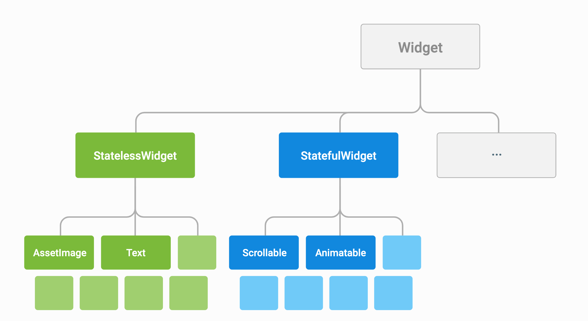
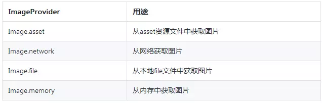
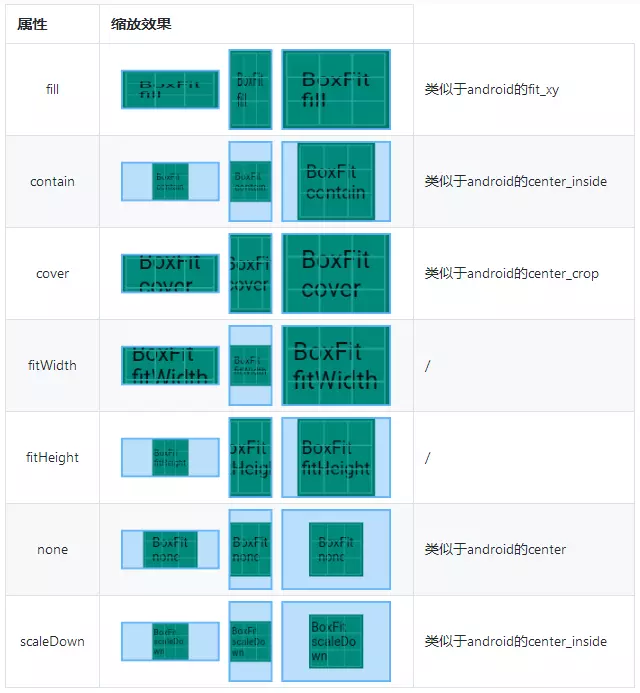
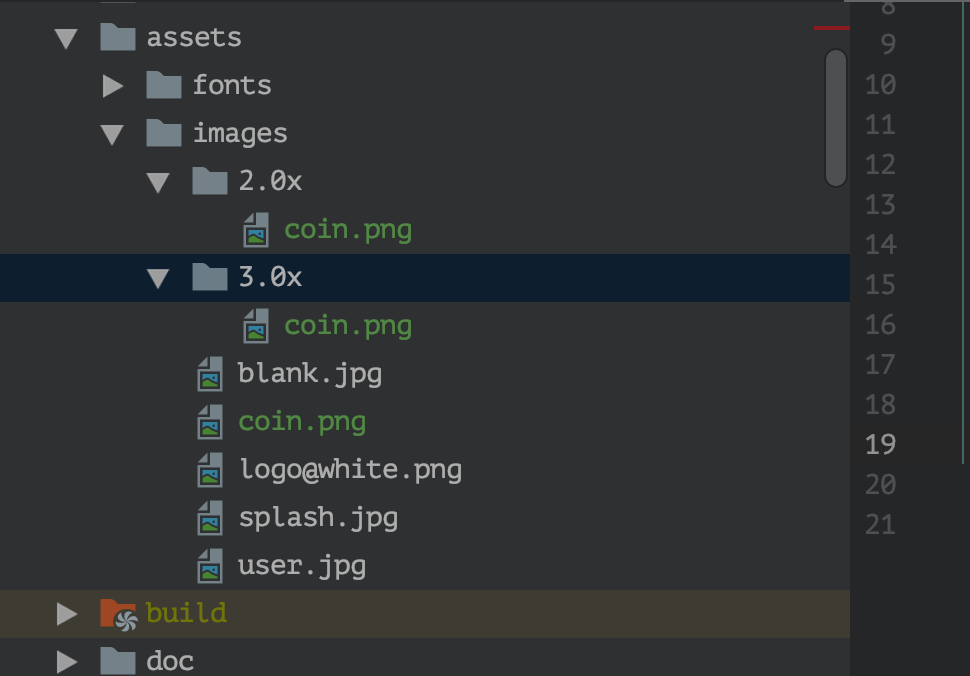
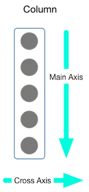
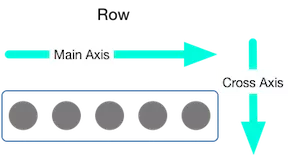

# Widget

> Flutter 的核心设计思想便是: Everything is a Widget.



Flutter 中，Widget 是不可变的，无法被直接更新，你需要操作 Widget 的状态。这就是有状态 (Stateful) 和无状态 (Stateless) Widget 概念的来源。StatelessWidget 如其字面意思—没有状态信息的 Widget。StatelessWidget 用于你描述的用户界面的一部分不依赖于除了对象中的配置信息以外的任何东西的场景。如果你想要根据 HTTP 请求返回的数据或者用户的交互来动态地更新界面，那么你就必须使用 StatefulWidget，并告诉 Flutter 框架 Widget 的状态 (State) 更新了，以便 Flutter 可以更新这个 Widget。

Flutter大约有 140+ Widget,下面列出一些常用的Widget

## 高频控件
|控件|描述|备注|
|:--|:--|:--:|
|MaterialApp|构建Material风格APP。|-|
|Scaffold|轻松实现 AppBar+FloatingActionButton的界面。|-|
|AppBar|同Android AppBar|-|
|FloatingActionButton|同Android|-|
|ListView|通吃ListView,RecyclerView,ScrollView|-|
|GridView|网格|-|
|Table|表格|-|
|RefreshIndicator|下拉刷新|-|
|Card|一个 Material Design 卡片。拥有一个圆角和阴影.|-|
|Padding|一个widget, 会给其子widget添加指定的填充。|-|
|Center|将其子widget居中显示在自身内部的widget。|-|
|Align|一个widget，它可以将其子widget对齐，根据子widget的大小自动调整大小。|-|
|Text|单一格式的文本。|-|
|RichText|一个富文本Text，可以显示多种样式的text。|-|
|TextField|文本输入框。|-|
|Switch|On/off 用于切换一个单一状态。|-|
|Checkbox|复选框，允许用户从一组中选择多个选项。|-|
|Opacity|使其子widget透明的widget。|-|
|Divider&VerticalDivider|一个逻辑1像素厚的水平分割线，两边都有填充.|-|
|SizedBox|一个特定大小的盒子。这个widget强制它的孩子有一个特定的宽度和高度。|-|
|Offstage|一个布局widget，可以控制其子widget的显示和隐藏。|-|
|OverflowBox|对其子项施加不同约束的widget，它可能允许子项溢出父级。|-|
|FittedBox|按自己的大小调整其子widget的大小和位置。|-|
|ConstrainedBox|对其子项施加附加约束的widget。|-|
|AspectRatio|一个widget，试图将子widget的大小指定为某个特定的长宽比。|-|
|Baseline|根据子项的基线对它们的位置进行定位的widget。|-|
|IntrinsicHeight|一个widget，它将它的子widget的高度调整其本身实际的高度。|-|
|IntrinsicWidth|一个widget，它将它的子widget的宽度调整其本身实际的宽度。|-|
|ExpansionPanel|可收缩的Panel。|-|
|AlertDialog|一个会中断用户操作的对话款，需要用户确认。|-|
|BottomSheet|BottomSheet是一个从屏幕底部滑起的列表。|-|
|Date & Time Pickers|日期&时间选择器。|-|

## Image
在 `Android` 中，我们需要处理各种图片,譬如网络图片,gif,webp,assets图片,点9图,etc,借助 `Glide` 我们能轻松实现这个需求. 但 `Flutter` 中,不需要任何第三方 `Library`,我们也能轻松实现。这便是 `Flutter` 为我们提供的 `Image`, `Image` 是一个用于展示图片的组件。支持 JPEG、PNG、GIF、Animated GIF、WebP、Animated WebP、BMP 和 WBMP 等格式。

## ImageProvider



- NetworkImage
- AssetImage
- FileImage
- MemoryImage byte

## Boxfit
相当于 Android 中的 ScaleType



## 分辨率适配

适配不同像素密度的手机



## 圆形图
```
CircleAvatar(
  backgroundImage: NetworkImage(Config.splashUrl),
  radius: 50,
)
```
## 圆弧图
```
ClipOval(
  child: Image.network(
    Config.splashUrl,
  ),
);
```

## 圆角图
```
ClipRRect(
  child: Image.network(
    Config.splashUrl,
  ),
  borderRadius: BorderRadius.all(Radius.circular(10)),
);
```

## 圆角图
```
Container(
  width: 100,
  height: 100,
  decoration: BoxDecoration(
      shape: BoxShape.rectangle,
      borderRadius: BorderRadius.all(Radius.circular(10)),
      image: DecorationImage(
          image: NetworkImage(Config.splashUrl),
          fit: BoxFit.cover)),
);
```

## FadeInImage
实现加载占位图以及淡入淡出效果
```
FadeInImage.assetNetwork(
    height: 200,
    fit: BoxFit.fitWidth,
    placeholder: Config.logoUrl,
    image: Config.imgNetGallery3);
```

## 点9图
```
Container(
  decoration: BoxDecoration(
    image: DecorationImage(
      centerSlice: Rect.fromLTWH(19, 13, 8, 8),
      image: AssetImage(
        Config.imgBubbleAssets,
      ),
    ),
  ),
  constraints: BoxConstraints(
    minWidth: 48,
    maxWidth: 480,
  ),
  padding: EdgeInsets.fromLTRB(18.5, 3.0, 14.5, 20.0),
  child: Text(
    '床前明月光\n疑似地上霜\n举头望明月\n低头思故乡\ntrue man does what he will, not what he must.',
    style: TextStyle(color: Colors.red, fontSize: 15.0),
  ),
);
```

## Gif & WebP
```
Row(
  children: <Widget>[
    Flexible(
      flex: 1,
      child: Image.asset(
        'animated_images/animated_flutter_stickers.webp',
        package: 'flutter_gallery_assets',
      ),
    ),
    Expanded(
        child: Image.asset(
      'animated_images/animated_flutter_lgtm.gif',
      package: 'flutter_gallery_assets',
    ))
  ],
);
```

## 图片平铺
```
Image.asset(
  Config.imgCoinAssets,
  repeat: ImageRepeat.repeat,
);
```

## BlendMode
```
Image(
  image: NetworkImage(Config.imgNetGallery3),
  color: Colors.pinkAccent,
  colorBlendMode: BlendMode.saturation,
)
```

## 图片缓存
```
/// 获取ImageCache 缓存对象
ImageCache imageCache = PaintingBinding.instance.imageCache;
/// 设置缓存图片的个数（根据情况自己设置，default = 1000）
imageCache.maximumSize = 1000;
/// 获取缓存图片个数
int num = imageCache.currentSize;
/// 设置缓存大小（根据情况自己设置，default = 50M）
imageCache.maximumSizeBytes = 50 << 20;
/// 获取图片缓存大小(单位是byte,需自行转换到 M)
int byte = imageCache.currentSizeBytes;
/// 清除图片缓存
imageCache.clear();
```

## Stack
堆叠控件,相当于 `Android` 中的 `FrameLayout`,子控件的位置分两种情况:
- `Positioned`: `left top right bottom` 来决定位置
- 非`Positioned` : 通过控制 `Stack` 的 `alignment` 属性来控制对齐方式

```
Stack(
  alignment: Alignment.topLeft,
  children: <Widget>[
    Container(
      color: Colors.pinkAccent,
      width: width,
      height: 200,
    ),
    Container(
      color: Colors.deepOrangeAccent,
      width: width / 2,
      height: 150,
    ),
    Container(
      color: Colors.green,
      width: 100,
      height: 100,
    ),
    Positioned(
      child: Container(
        color: Colors.deepPurpleAccent,
        width: 100,
        height: 100,
      ),
      right: 0,
      bottom: 0,
    )
  ],
)
```

## IndexedStack
一次只显示一个

```
IndexedStack(
  index: _index,
  children: <Widget>[
    Icon(
      Icons.wifi,
      size: 100,
      color: Colors.redAccent,
    ),
    Icon(
      Icons.wifi_lock,
      size: 100,
      color: Colors.greenAccent,
    ),
    Icon(
      Icons.signal_wifi_off,
      size: 100,
      color: Colors.blueAccent,
    ),
    Icon(
      Icons.wifi_tethering,
      size: 100,
      color: Colors.deepPurpleAccent,
    ),
  ],
)
```

## Flex
`Flex` 是 `Flexible Box` 的缩写，意为 **弹性布局**，用来为盒状模型提供最大的灵活性。[flex盒子模型](https://www.runoob.com/w3cnote/flex-grammar.html).`Flutter` 在布局上也提供了完整的 `Flex` 布局能力。在 `Flutter` 中，主要通过 `Flex`,`Row`,`Column`,`Flexible`,`Expanded`,`Spacer` 来实现 **弹性布局**。

<div align="center">

。

</div>



垂直布局时：y轴为主轴，x轴为副轴!



水平布局时：x轴为主轴，y轴为副轴!

小结:
1. `Row` 相当于 **LinearLayout** `orientation = horizontal`
2. `Column` 相当于 **LinearLayout** `orientation = vertical`
3. `Flexible` 相当于 **LinearLayout** `weight = xxx `,用途是铺满父布局剩余空间
4. `Expanded` 继承自 `Flexible`
5. `Spacer` 实质上是 build 了一个 `Expanded`


```
Flex(
  direction: Axis.vertical,
  children: <Widget>[
    Row(
      children: <Widget>[
        Container(
          color: Colors.redAccent,
          width: 100,
          height: 50,
        ),
        Expanded(
            child: Container(
          color: Colors.greenAccent,
          height: 50,
        )),
        Container(
          color: Colors.blueAccent,
          width: 100,
          height: 50,
        ),
      ],
    ),
    Spacer(
      flex: 1,
    ),
    Flexible(
        flex: 2,
        child: Container(
          alignment: Alignment.center,
          color: Colors.purpleAccent,
          child: Text(
            "Flexible",
            style: TextStyle(
                fontSize: 20,
                fontWeight: FontWeight.w600,
                color: Colors.white),
          ),
        )),
    Row(
      mainAxisAlignment: MainAxisAlignment.center,
      mainAxisSize: MainAxisSize.max,
      children: <Widget>[
        Column(
          children: <Widget>[
            Container(
              height: 80,
              width: 100,
              alignment: Alignment.center,
              color: Colors.redAccent,
              child: Text(
                "RED",
                style: TextStyle(
                    fontSize: 20,
                    fontWeight: FontWeight.w600,
                    color: Colors.white),
              ),
            ),
            Container(
              height: 80,
              width: 100,
              alignment: Alignment.center,
              color: Colors.greenAccent,
              child: Text(
                "GREEN",
                style: TextStyle(
                    fontSize: 20,
                    fontWeight: FontWeight.w600,
                    color: Colors.white),
              ),
            ),
            Container(
              height: 80,
              width: 100,
              alignment: Alignment.center,
              color: Colors.blueAccent,
              child: Text(
                "Blue",
                style: TextStyle(
                    fontSize: 20,
                    fontWeight: FontWeight.w600,
                    color: Colors.white),
              ),
            ),
          ],
        ),
        Expanded(
            child: Column(
          mainAxisSize: MainAxisSize.min,
          crossAxisAlignment: CrossAxisAlignment.end,
          children: <Widget>[
            Container(
              color: Colors.cyanAccent,
              width: 80,
              height: 80,
            )
          ],
        ))
      ],
    )
  ],
)
```

## Container
相当于 Android 中的 ViewGroup
- BoxDecoration 提供了对背景色，边框，圆角，阴影和渐变等功能的定制能力。
- BoxConstraints 其实是对 Container 组件大小的描述。

##  GestureDetector
在Flutter中手势识别也是一个widget！使用时只需要将GestureDetector包裹在目标widget外面，再实现对应事件的函数即可。


## Flow


## 其他
- ClipPath & ClipRect
- CustomPaint
- DragTarget
- FutureBuilder & StreamBuilder

## 小结
1. Flutter Widge 并不支持 类似于 Android的 Visibility 属性,只能设置 `alpha` 或者 `Offstage` 或者通过 `State` 来删除
2. 大概约 140+ 控件,需要多实践

## 参考链接
- [widget英文文档](https://flutter.dev/docs/development/ui/widgets)
- [widget中文文档](https://flutterchina.club/widgets/)
- [flutter Widget 在线预览](https://flutter-widget-livebook.blankapp.org/basics/introduction/)
- [在线构建Widget](https://ui.flutterdart.cn/)
- [Android开发者Flutter指南](https://flutter.cn/docs/get-started/flutter-for/android-devs)
- [iOS开发者Flutter指南](https://flutter.cn/docs/get-started/flutter-for/ios-devs)
