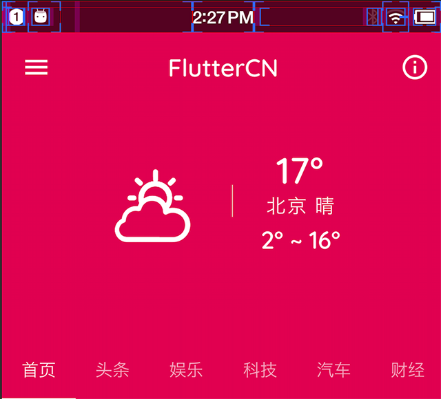

# FlutterCN

<a class="github-button" href="https://github.com/Pluckypan/FlutterCN" data-icon="octicon-star" data-show-count="true" aria-label="FlutterCN">Star</a>

## 概述
Flutter是Google开发的一套全新的跨平台、开源UI框架，支持iOS、Android系统开发，并且是未来新操作系统Fuchsia的默认开发套件。自从2017年5月发布第一个版本[v0.0.6](https://github.com/flutter/flutter/releases/tag/v0.0.6)以来，目前Flutter已经发布了近[224](https://github.com/flutter/flutter/releases)个版本，并且在2018年5月发布了第一个“Ready for Production Apps”的Beta 3版本，6月20日发布了第一个“Release Preview”版本。

在Flutter诞生之前，已经有许多跨平台UI框架的方案
1. 基于浏览器技术的 Hybird、Cordova、AppCan
2. 基于桥接Native组件,即使用HTML+JavaScript渲染成原生控件：如RN、WEEX

基于WebView的框架优点很明显，它们几乎可以完全继承现代Web开发的所有成果（丰富得多的控件库、满足各种需求的页面框架、完全的动态化、自动化测试工具等等），当然也包括Web开发人员，不需要太多的学习和迁移成本就可以开发一个App。同时WebView框架也有一个致命（在对体验&性能有较高要求的情况下）的缺点，那就是WebView的渲染效率和JavaScript执行性能太差。再加上Android各个系统版本和设备厂商的定制，很难保证所在所有设备上都能提供一致的体验。

为了解决WebView性能差的问题，以React Native为代表的一类框架将最终渲染工作交还给了系统，虽然同样使用类HTML+JS的UI构建逻辑，但是最终会生成对应的自定义原生控件，以充分利用原生控件相对于WebView的较高的绘制效率。与此同时这种策略也将框架本身和App开发者绑在了系统的控件系统上，不仅框架本身需要处理大量平台相关的逻辑，随着系统版本变化和API的变化，开发者可能也需要处理不同平台的差异，甚至有些特性只能在部分平台上实现，这样框架的跨平台特性就会大打折扣。

Flutter则开辟了一种全新的思路，从头到尾重写一套跨平台的UI框架，包括UI控件、渲染逻辑甚至开发语言。渲染引擎依靠跨平台的 [Skia](https://github.com/google/skia) 图形库来实现，依赖系统的只有图形绘制相关的接口，可以在最大程度上保证不同平台、不同设备的体验一致性，逻辑处理使用支持AOT的Dart语言，执行效率也比JavaScript高得多。 [编译](compile)

## 架构

Flutter的架构主要分成三层:Framework，Engine和Embedder。

Framework使用dart实现，包括Material Design风格的Widget,Cupertino(针对iOS)风格的Widgets，文本/图片/按钮等基础Widgets、渲染、动画、手势等。此部分的核心代码是：flutter仓库下的flutter package，以及sky_engine仓库下的io,async,ui(dart:ui库提供了Flutter框架和引擎之间的接口)等package。

Engine使用C++实现，主要包括:[Skia](https://github.com/google/skia),Dart和Text。Skia 是开源的二维图形库，提供了适用于多种软硬件平台的通用API。其已作为Google Chrome，Chrome OS，Android, Mozilla Firefox, Firefox OS等其他众多产品的图形引擎，支持平台还包括Windows7+,macOS 10.10.5+,iOS8+,Android4.1+,Ubuntu14.04+等。

Dart部分主要包括:Dart Runtime，Garbage Collection(GC)，如果是Debug模式的话，还包括JIT(Just In Time)支持。Release和Profile模式下，是AOT(Ahead Of Time)编译成了原生的arm代码，并不存在JIT部分。Text即文本渲染，其渲染层次如下：衍生自minikin的libtxt库(用于字体选择，分隔行)。HartBuzz用于字形选择和成型。Skia作为渲染/GPU后端，在Android和Fuchsia上使用FreeType渲染，在iOS上使用CoreGraphics来渲染字体。

Embedder是一个嵌入层，即把Flutter嵌入到各个平台上去，这里做的主要工作包括渲染Surface设置,线程设置，以及插件等。从这里可以看出，Flutter的平台相关层很低，平台(如iOS)只是提供一个画布，剩余的所有渲染相关的逻辑都在Flutter内部，这就使得它具有了很好的跨端一致性。

## Why Flutter
1. 跨平台: 用原有`1/3`的人力同一套代码可以开发不同平台 `Android & iOS & Web` 同一标准的 APP
2. 开发语言: Dart 是一门现代的面对对象的高级语言,融合了许多现代语言的特性,熟悉 Java、JavaScript 的人入门门槛较低
3. 便捷的包管理,活跃的社区氛围
4. 官方提供了丰富的控件,脚手架
5. Debug 模式下的 **热重载、热重启** 功能,方便快速构建界面
6. 因为 `Google`：虽然基于底层统一渲染的跨平台方案有很多，在移动端有实际应用的如QT、cocos2d等,但是 **Flutter的背后是Google**

<!-- GitHub Buttons -->

