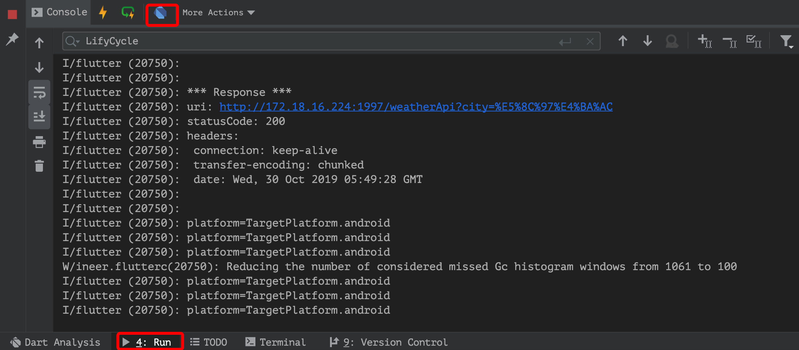
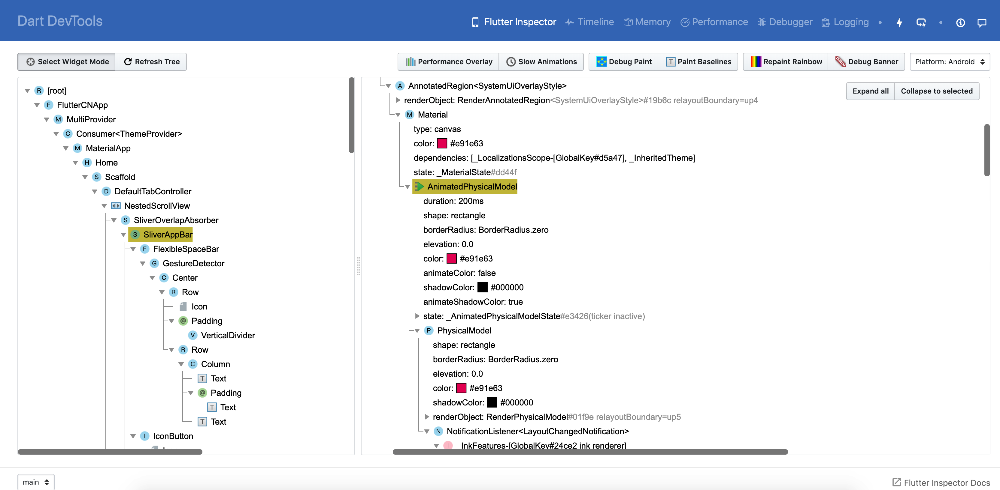

## 调试
1. 断点调试：和 Android 调试差不多
2. 打印日志：print(xxx)
3. ` command + \` 热重载 ` command + shift + \ ` 热重启
4. ` Alt + command + \` 所有设备热重载 ` Alt + command + shift + \ ` 所有设备热重启
5. 没有 logcat
6. 测试应用启动时间 `$ flutter run --trace-startup --profile`
7. 如果在终端运行,按 `r` 键热重载

## 参考链接
- [调试 Flutter 应用](https://flutter.cn/docs/testing/debugging)
